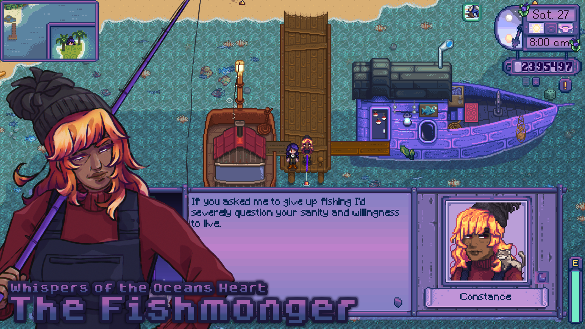

# The Fishmonger - Whispers of the Oceans Heart

An expansion focusing on the fishmonger Constance whose dream of meeting a mermaid from her past opens up a complete new storyline and island where the farmer gets to meet new NPCs, explore areas featuring new forage, fish and other things!

## General Information
### Dependencies
- ContentPatcher
- MMAP
- Spacecore
- MEEP
- Item Extensions
- Grass Variety

### Soft Dependency
- Have More Children

### Suggested mods
Here a variety of mods that go well with my mod. They are not needed but serve a smooth transition for additional gameplay alongside it.
- [???]

### Compatibility
The mod is compatible with [lnh's Ginger Island Overhaul](https://www.nexusmods.com/stardewvalley/mods/15939), [SVE](https://www.nexusmods.com/stardewvalley/mods/3753) and [The Submarine](https://www.nexusmods.com/stardewvalley/mods/12285).

TBC...
